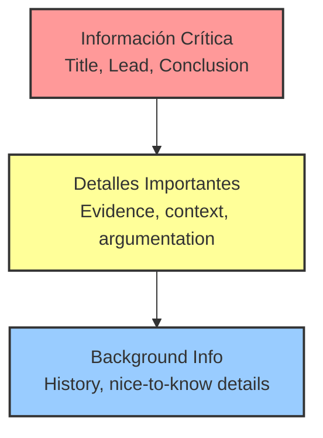
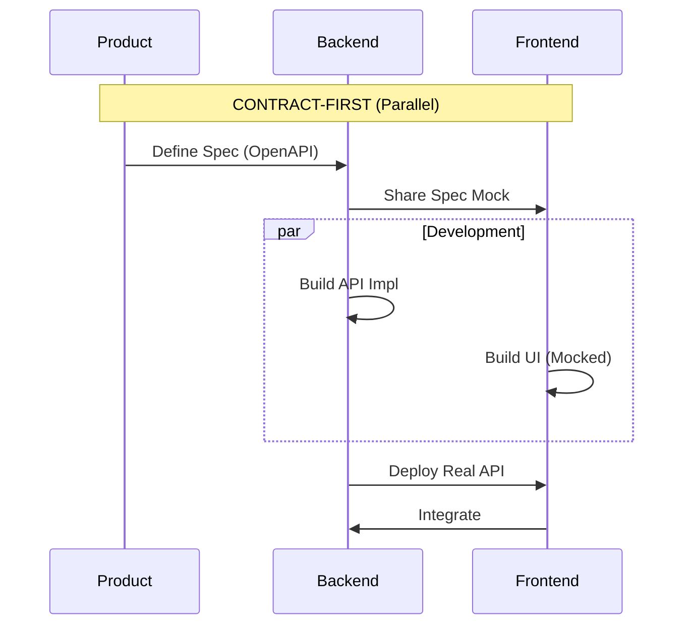
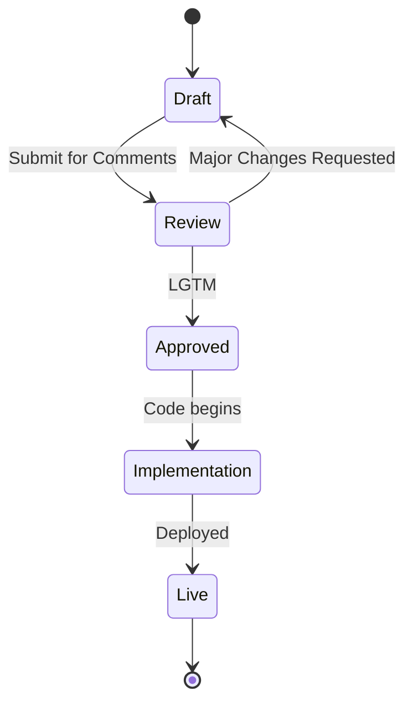

# TEMA 1.1.1. ELIMINACIÓN DE VOZ PASIVA

**Tiempo estimado**: 30 minutos
**Nivel**: Intermedia
**Prerrequisitos**: Conceptos de Módulo 0 (Agencia gramatical)

## ¿Por qué importa este concepto?

En la documentación técnica, la ambigüedad se considera un defecto crítico (bug). Cuando se escribe una frase como "Los datos fueron procesados", se oculta información vital para el lector: ¿Quién o qué procesó los datos? ¿Fue el usuario manualmente? ¿El backend automáticamente? ¿Un proceso en segundo plano?

La **Voz Pasiva** diluye la responsabilidad y aumenta lo que llamamos "carga cognitiva": el esfuerzo mental necesario para procesar la información. Al eliminarla, logramos tres objetivos fundamentales de ingeniería:

1. **Precisión**: Se define explícitamente el actor del sistema.
2. **Concisión**: Las oraciones activas son, en promedio, un 20-30% más cortas.
3. **Accionabilidad**: El usuario sabe exactamente qué debe hacer o qué esperar del sistema.

**Ejemplo real**: En la documentación de plataformas como Stripe o Google Cloud, raramente encontrará construcciones como "El pago es recibido". En su lugar, encontrará "Stripe recibe el pago".

## Conexión con conocimientos previos

En el Módulo 0 establecimos que la escritura técnica busca la ruta más eficiente para transmitir información. Podemos usar la analogía de la complejidad algorítmica:

* La **Voz Activa** es una operación de complejidad constante ($O(1)$): el cerebro conecta "Sujeto > Acción" (Acceso directo).
* La **Voz Pasiva** es una operación más costosa, similar a $O(n^2)$, porque obliga al cerebro a buscar en el contexto quién realizó la acción.

---

## Comprensión intuitiva

Para los desarrolladores, es útil pensar en la gramática como si fuera código:

* **Voz Pasiva** es comparable a ejecutar una función anónima sin argumentos claros: `process_stuff()`. ¿Qué entra? ¿Qué contexto usa? El comportamiento es opaco.
* **Voz Activa** es comparable a una función con tipos explícitos: `User.click(Button)`. La estructura es `Sujeto -> Verbo -> Objeto`.

### Ejemplo motivador

Imagine que un desarrollador lee lo siguiente en un archivo README:

> "La configuración debe ser actualizada antes del despliegue."

El desarrollador se detiene y pregunta: "¿Por quién? ¿Debo hacerlo yo manualmente? ¿Lo hace el pipeline de CI/CD automáticamente?". Esta duda detiene el flujo de trabajo y puede provocar errores en producción.

---

## Definición formal

La **Voz Activa** sigue una estructura gramatical directa y lineal:
$$ Sujeto + Verbo + Objeto $$

La **Voz Pasiva** invierte esta estructura, convirtiendo al objeto de la acción en el sujeto gramatical, generalmente introduciendo el verbo auxiliar "ser":
$$ Objeto + ser + participio (+ por + Agente) $$

### Propiedades fundamentales

1. **Agencia Explícita**: El actor siempre precede a la acción.
2. **Direccionalidad**: El flujo de información es lineal (de izquierda a derecha).
3. **Economía Léxica**: Elimina verbos auxiliares innecesarios como "fue", "ha sido" o "es".

---

## Implementación práctica

En ingeniería de software no siempre es posible evitar la voz pasiva (a veces el actor es irrelevante), pero debemos refactorizar agresivamente cuando la acción es crítica.

### Algoritmo de Refactorización

Para corregir frases pasivas, siga este procedimiento paso a paso:

1. **Detectar**: Busque construcciones del tipo "ser + participio" (ejemplos: es hecho, fue enviado, será cancelado).
2. **Identificar Agente**: Pregúntese "¿Quién realiza la acción?".
3. **Reubicar**: Mueva ese Agente al inicio de la oración.
4. **Eliminar Auxiliares**: Borre los verbos auxiliares "ser" o "estar".

### Ejemplos de Refactorización (Antes vs. Después)

#### Caso 1. Instrucciones al Usuario

**Pasiva (Incorrecto):**
> "El botón 'Deploy' deberá ser presionado cuando los tests hayan pasado."
> *Problema: Ambigüedad. ¿Es automático o manual?*

**Activa (Correcto):**
> "Presione el botón 'Deploy' una vez que pasen los tests."
> *Solución: Instrucción imperativa directa al lector.*

#### Caso 2: Descripción del Sistema

**Pasiva (Incorrecto):**
> "Una excepción es lanzada por el servidor si el token es inválido."
> *Problema: Excesivamente largo (12 palabras).*

**Activa (Correcto):**
> "El servidor lanza una excepción si el token es inválido."
> *Solución: Conciso (9 palabras). Ahorro del 25% de texto.*

---

## Práctica Guiada

Intente refactorizar este párrafo técnico común:

**Texto Original (Legacy):**
"Los logs son rotados cada 24 horas por el sistema. Si el espacio en disco es excedido, una alerta será enviada al administrador."

**Análisis de Refactorización:**

1. *Segmento 1*: "son rotados por el sistema" -> Agente identificado: "el sistema".
2. *Segmento 2*: "espacio es excedido" -> Agente implícito: "los logs".
3. *Segmento 3*: "alerta será enviada" -> Agente: "el sistema".

**Texto Refactorizado:**
"El sistema rota los logs cada 24 horas. Si los logs exceden el espacio en disco, el sistema envía una alerta al administrador."

---

## Errores frecuentes

### Error 1. La pasiva "Zombie"

Ocurre cuando se oculta al actor deliberadamente para no sonar "agresivo" o directo.

* *Incorrecto*: "Se cometieron errores en la migración." (Nadie asume la culpa).
* *Correcto*: "El equipo subestimó la carga en la migración." (Honestidad y responsabilidad).

### Error 2: Confundir Pasiva con Estado

No toda construcción "ser + participio" es pasiva. A veces describe un estado del sistema.

* *Válido*: "El sistema está caído." (Esto describe un estado, no una acción pasiva).

---

## Resumen del concepto

**En una frase**: Coloque al actor (Sujeto) antes de la acción (Verbo) para eliminar dudas sobre la responsabilidad.

**Cuándo usarlo**: En la gran mayoría instrucciones, descripciones de procesos y mensajes de error.

**Excepción**: Úsela solo cuando el actor es desconocido o irrelevante (ejemplo: "La función fue deprecada en v2.0", donde no importa qué desarrollador específico la deprecor).

**Siguiente paso**: Estructura de pirámide invertida (Tema 1.1.2).
# TEMA 1.1.2: ESTRUCTURA DE PIRÁMIDE INVERTIDA

**Tiempo estimado**: 15 minutos
**Nivel**: Principiante
**Prerrequisitos**: Tema 1.1.1 (Voz Pasiva)

## ¿Por qué importa este concepto?

En la escuela nos enseñaron a escribir ensayos: Introducción -> Desarrollo -> Clímax -> Conclusión.
Esto funciona para novelas de misterio.
Para documentación técnica, **es un desastre**.

Un ingeniero que busca un error a las 3 AM no quiere misterio. Quiere la solución **YA**.
Si escondes la respuesta al final del párrafo, estás quemando su tiempo.

## Conexión con conocimientos previos

* **Tema 1.1.1**: Usar voz activa hace que las oraciones sean directas. La Pirámide Invertida hace que el *párrafo* sea directo.
* **TL;DR** (Too Long; Didn't Read): Es la aplicación más pura de este concepto.

---

## Comprensión intuitiva

Imagina que eres un periodista de 1920 enviando una noticia por telégrafo durante la guerra.
La línea puede cortarse en cualquier momento.
Tienes que decir lo más importante **primero**.

1. "El Titanic se hundió". (Lead)
2. "Murieron 1500 personas". (Detalles clave)
3. "La orquesta tocó hasta el final". (Color/Contexto)

Si se corta la línea después de la frase 1, la noticia principal llegó.

---

## Definición formal



La **Pirámide Invertida** ordenan la información por orden de importancia decreciente, no cronológico.

### Estructura

1. **El Lead (La Cima de la Pirámide)**: ¿Qué pasó? ¿Cuál es el resultado? ¿Qué debo hacer?
2. **El Cuerpo (El Medio)**: Evidencia, argumentos, pasos detallados.
3. **El Contexto (La Punta)**: Antecedentes, enlaces relacionados, "nice to know".

---

## Implementación práctica

### Ejemplo: Reporte de Estatus

**Mal (Cronológico)**:
> "Ayer revisamos los logs y vimos errores. Luego reiniciamos el servidor. Pareció funcionar, pero luego falló de nuevo. Investigamos la DB y vimos bloqueos. Al final, liberamos los bloqueos y el sistema subió."

**Bien (Pirámide Invertida)**:
> **El sistema está estable ahora.**
> Causa raíz: Bloqueos en la base de datos que liberamos manualmente.
> *Cronología*: Detectamos errores ayer, reiniciamos (fallido), encontramos bloqueos y resolvimos.

### Ejemplo: Documentación de Función

**Mal**:
> "Esta función primero inicializa un buffer, luego itera sobre el array, verifica nulos... y finalmente retorna el promedio."

**Bien**:
> **Retorna el promedio de un array de números.** (Ignora nulos automáticamente).
> *Detalles de implementación*: Usa un buffer interno para...

---

## Errores frecuentes

### Error 1. "Enterrar el Lead" (Burying the Lead)

Empezar con "Debido a los recientes cambios en la arquitectura de microservicios..." en lugar de "El endpoint /users está deprecado".

### Error 2: Asumir que el lector leerá todo

Los usuarios **escanean** (patrón de lectura en F). Solo leen las primeras palabras de cada párrafo.
Si la información importante está en la línea 5, es invisible.

---

## Resumen del concepto

**En una frase**: Dile al lector qué pasó antes de explicarle cómo pasó.

**Regla de Oro**: Si el usuario deja de leer después de la primera frase, ¿se llevó la información vital? Si es sí, usaste bien la pirámide.

**Siguiente paso**: Ejercicios para reescribir textos cronológicos.
# TEMA 1.2.1. MAPEO DE AUDIENCIA

**Tiempo estimado**: 20 minutos
**Nivel**: Intermedio
**Prerrequisitos**: Tema 1.1.X (Claridad y Estructura)

## ¿Por qué importa este concepto?

El error #1 en documentación técnica no es la gramática, es la **Falta de Empatía**. Escribirle a un Senior Architect como si fuera un Junior, o explicarle a un Usuario Final cómo funciona la base de datos interna.

Si no defines tu audiencia, escribes para nadie.
Distinguir entre **Usuario** (quien usa tu código) y **Mantenedor** (quien arregla tu código) es la diferencia entre una librería exitosa y "abandonware".

## Conexión con conocimientos previos

En programación orientada a objetos, tenemos `public` (interfaz para el usuario) y `private` (implementación para el mantenedor).
La documentación debe respetar ese mismo encapsulamiento.

* **Docs de Usuario**: API pública. Contrato. Cómo se usa.
* **Docs de Mantenedor**: Internals. Lógica de negocio. Por qué se hizo así.

---

## Comprensión intuitiva

Imagina que compras un coche.

1. **Manual del Conductor (Usuario)**: Cómo arrancar, cómo poner aire acondicionado, qué gasolina usa. (Caja Negra).
2. **Manual de Taller (Mantenedor)**: Torque de los tornillos de la culata, diagrama eléctrico del alternador. (Caja Blanca).

Si el manual del conductor explicara el diagrama eléctrico en la página 1, nadie conduciría. Si el manual de taller solo dijera "gire la llave", nadie podría repararlo.

---

## Definición formal

El **Mapeo de Audiencia** es el proceso de identificar el modelo mental y las necesidades del lector antes de escribir.

### Matriz de Audiencia Técnica

| Dimensión | **USUARIO (Consumidor)** | **MANTENEDOR (Colaborador)** |
| :--- | :--- | :--- |
| **Objetivo** | Resolver un problema rápido. | Entender/Modificar el sistema. |
| **Perspectiva** | Caja Negra (Black Box). | Caja Blanca (White Box). |
| **Pregunta clave** | "¿Cómo hago X?" | "¿Por qué X funciona así?" |
| **Artefacto** | README, Guías, API Reference. | CONTRIBUTING, Architecture Docs, Comentarios inline. |

---

## Implementación práctica

### Algoritmo de Segmentación

Antes de escribir un documento, ejecuta este `switch`:

1. **Caso: README / Tutorial** -> **Modo Usuario**.
    * *Ocultar*: Detalles de implementación, dependencias internas, deuda técnica.
    * *Mostrar*: Instalación, configuración, ejemplos de uso (Happy Path).

2. **Caso: Design Doc / Pull Request** -> **Modo Mantenedor**.
    * *Ocultar*: Marketing, promesas vacías.
    * *Mostrar*: Trade-offs, riesgos, complejidad algorítmica ($O(n)$), alternativas rechazadas.

### Ejemplo Comparativo: Endpoint de Login

#### Versión Usuario (Swagger/Docs)
>
> **POST /login**
> Autentica un usuario y devuelve un JWT.
>
> * **Input**: `{user, pass}`
> * **Output**: `200 OK { token }`
> * **Error**: `401 Invalid Credentials`

*(Nota: Al usuario no le importa si usas un hash bcrypt o argon2, solo quiere su token).*

#### Versión Mantenedor (Comentario/Wiki interna)
>
> **Módulo de Autenticación**
> Usamos `bcrypt` con work factor 12.
> **Warning**: No aumentar el factor a >14 porque la latencia de login excede los 500ms y rompe el SLA.
> La validación de password ocurre *antes* de la conexión a DB para mitigar ataques DoS.

---

## Errores frecuentes

### Error 1. "Leaking Internals" (La Fuga)

Explicar la implementación en la guía de usuario.

* *Mal*: "Para guardar el archivo, instanciamos un `FileStream` con buffer de 4kb..."
* *Bien*: "Para guardar el archivo, llame a `save()`."

### Error 2: Asumir el contexto del autor

Escribir pensando que el lector lleva 6 meses en el proyecto.

* *Síntoma*: "Ejecuta el script de siempre."
* *Solución*: "Ejecuta `./scripts/deploy.sh`."

---

## Resumen del concepto

**En una frase**: Decide si estás escribiendo para quien *conduce* el coche (Usuario) o para quien *repara* el motor (Mantenedor), y no mezcles los manuales.

**Cuándo usarlo**: Siempre. Define tu audiencia en la primera línea mentalmente.

**Prerrequisito crítico**: Teoría de la Mente (capacidad de atribuir desconocimiento a otros).

**Siguiente paso**: Módulo 2 - Documentación en el Código (donde aplicaremos esto a Comentarios vs. Docstrings).
# TEMA 2.1.1. COMENTARIOS Y DOCSTRINGS (EL POR QUÉ)

**Tiempo estimado**: 25 minutos
**Nivel**: Básico
**Prerrequisitos**: Tema 1.2.1 (Usuario vs Mantenedor)

## ¿Por qué importa este concepto?

El código explica el **Qué** y el **Cómo**. Los comentarios solo deben existir para explicar el **Por Qué**.

Un comentario que repite lo que dice el código es ruido ("Code Smell"). Un comentario que explica una decisión de negocio compleja o una trampa oculta es oro puro.
Tu objetivo es escribir código que no necesite comentarios, y luego escribir comentarios donde el código no sea suficiente.

## Conexión con conocimientos previos

En el Módulo 1.2.1 aprendimos sobre "Caja Negra" vs "Caja Blanca".

* **Docstrings (Caja Negra)**: Para el Usuario. Explican el contrato (inputs/outputs).
* **Comentarios Inline (Caja Blanca)**: Para el Mantenedor. Explican la implementación (hacks, optimizaciones).

---

## Comprensión intuitiva

Piensa en los subtítulos de una película.

* **Mal comentario**: (Personaje abre la puerta) -> Subtítulo: "Abre la puerta". (Obvio, redundante).
* **Buen comentario**: (Personaje duda antes de abrir) -> Subtítulo: "*Teme que el asesino esté dentro*". (Contexto invisible).

El código es la acción. El comentario es el contexto invisible.

---

## Definición formal

1. **Comentario Pragmático**: Aporta información que no existe en la sintaxis del lenguaje (intención, limitaciones de negocio, referencias a tickets de Jira).
2. **Docstring (Documentation String)**: Texto estructurado asociado a una función/clase que describe su interfaz pública.

### La Regla de Oro
>
> "No comentes código malo; reescríbelo." — Brian Kernighan

Antes de escribir `// Calcula el total`, renombra la variable `t` a `total_invoice_amount`.

---

## Implementación práctica

### Caso 1. El comentario redundante (Anti-patrón)

```python
# Incrementa i en 1
i = i + 1  

# Función que obtiene usuarios
def get_users():
    ...
```

*Crítica*: El lector sabe leer código. Esto insulta su inteligencia y añade deuda de mantenimiento (si el código cambia, el comentario miente).

### Caso 2: El comentario de "Por Qué" (Patrón)

```python
# Usamos un sleep de 2s porque la API de legacy-bank 
# tiene una race condition si reintentamos inmediatamente.
# Ver Ticket JIRA-1234.
time.sleep(2)
```

*Valor*: Explicación crítica. Si borras el sleep para "optimizar", rompes la integración.

### Caso 3: Docstrings Estructurados

Usa formatos estándar (Google, NumPy, Sphinx) para que los IDEs ayuden al usuario.

```python
def connect_db(timeout: int = 30) -> Connection:
    """
    Establece conexión con la base de datos principal.

    Args:
        timeout: Segundos máximos de espera. Si excede, lanza TimeoutError.
                 PRECAUCIÓN: No usar >60s en prod para evitar bloqueos de gunicorn.

    Returns:
        Objeto Connection activo.
    """
```

---

## Guía de Estilo Rápida

1. **TODOs**: Úsalos para deuda técnica reconocida. `// TODO(autor): Refactorizar esto cuando migremos a v2`.
2. **Hacks**: Admite cuando el código es feo. `// FIXME: Solución temporal. Esto es O(n^2), mover a worker en el futuro`.
3. **Referencias**: Linkea a StackOverflow o Docs oficiales. `// Adaptado de: https://stackoverflow.com/...`

---

## Resumen del concepto

**En una frase**: El código dice qué hace. Los comentarios dicen por qué lo hace así (y por qué no de otra forma).

**Cuándo comentar**: Cuando tomaste una decisión no obvia, cuando hay un bug conocido de una librería externa, o cuando la lógica es matemáticamente compleja.

**Siguiente paso**: El README (El documento más importante de tu repositorio).
# TEMA 2.2.1. ESTRUCTURA DE UN README GANADOR

**Tiempo estimado**: 30 minutos
**Nivel**: Intermedio
**Prerrequisitos**: Tema 1.2.1 (Usuario vs Mantenedor)

## ¿Por qué importa este concepto?

El README es la **Landing Page** de tu código.
Es lo primero que ve un desarrollador en GitHub. Es tu única oportunidad para causar una buena impresión.
Un mal README grita "Proyecto abandonado" o "Difícil de usar". Un buen README convierte visitantes en usuarios (o colaboradores).

Tienes aproximadamente **10 segundos** de la atención del lector para responder dos preguntas:

1. ¿Qué hace esto?
2. ¿Cómo lo hago correr en mi máquina?

## Conexión con conocimientos previos

Aplicamos la **Pirámide Invertida** (Tema 1.1.2) y el **Mapeo de Audiencia** (Tema 1.2.1).

* *Pirámide*: Pon el propósito y el "Quickstart" arriba. Mueve la configuración avanzada abajo.
* *Audiencia*: La mayoría de los lectores del README son **Usuarios** que quieren probarlo, no **Mantenedores** que quieren compilarlo desde cero.

---

## Comprensión intuitiva

Imagina que entras a una tienda de Apple (Landing Page).

* **Lo que ves**: Mesas con productos listos para usar (El "Qué" y el "Cómo").
* **Lo que no ves**: Los planos eléctricos de la tienda o el reglamento de los empleados (El "Internals").

Tu README debe sentirse como la tienda, no como el almacén.

---

## Definición formal

Un README efectivo debe contener, en orden de prioridad:

1. **Nombre y One-Liner**: Qué es.
2. **Badges**: Estado del build, versión, licencia (Prueba social).
3. **Descripción / Problema**: Qué soluciona.
4. **Quick Start**: El camino más corto para ver el "Hello World".
5. **Features**: Lista de capacidades clave.
6. **Configuración**: Opciones avanzadas.

---

## Implementación práctica

### Anatomía de un README Perfecto

```markdown
# 🚀 RocketLib (El Título)

> La librería más rápida para enviar cohetes a Marte en Python. (El One-Liner)

[](...) [](...) (Badges)

## ¿Por qué usar RocketLib? (El Gancho)
Las librerías actuales son lentas. RocketLib usa Rust por debajo para lograr...

## Instalación (La Acción)
```bash
pip install rocket-lib
```

## Quick Start (El "Hello World")

```python
import rocket

rocket.launch(target="Mars")
# > 🚀 Despegando en 3, 2, 1...
```

## Configuración Avanzada (La Cola de la Pirámide)

...

```

### El Anti-Patrón: "El Muro de Texto"

*   Empezar con la historia del proyecto. "Este proyecto nació en 2019 cuando..." (A nadie le importa aún).
*   Empezar con los requisitos de compilación. "Instala GCC v9, Make v4..." (Aburrido. Solo quiero usarlo).

### El Patrón: "Zero to Hero"

Tu sección de instalación debe ser copiables y pegables.
*   *Mal*: "Descarga el código y compílalo."
*   *Bien*:
    ```bash
    git clone ...
    cd ...
    ./install.sh
    ```

---

## Resumen del concepto

**En una frase**: Trata a tu README como un producto de marketing. Vende la solución y facilita la adopción inmediata.

**La Regla de los 10 Segundos**: Si no puedo ejecutar tu código en 10 segundos (o entender qué hace), cerraré la pestaña.

**Siguiente paso**: Generación de Ejercicios para auditar READMEs reales.
# TEMA 3.1.1. OPENAPI/SWAGGER (CONTRACT-FIRST)

**Tiempo estimado**: 35 minutos
**Nivel**: Intermedio
**Prerrequisitos**: Módulo 2 (Documentación en Código)

## ¿Por qué importa este concepto?

Imagina construir un puente empezando desde los dos extremos sin planos, esperando encontrarse en el medio.
Eso es desarrollar APIs **Code-First** (primero el código, luego la doc).
Resultado: El Frontend espera un array y el Backend manda un objeto. El puente se cae.

**Contract-First** significa dibujar el plano (OpenAPI Spec) antes de poner un solo ladrillo (código).

## Conexión con conocimientos previos

* **Tema 2.2.1 (README)**: Un README explica *cómo instalar*. Una Spec de OpenAPI explica *cómo interactuar*.
* **Tema 1.2.1 (Audiencia)**: La audiencia de tu API es una máquina (que necesita precisión estricta) y un humano (que necesita ejemplos claros).

---

## Comprensión intuitiva

OpenAPI es el **Contrato de Alquiler** entre el Backend y el Frontend.
Firmas el contrato *antes* de mudarte.
Si el contrato dice "El alquiler son 500 euros", el casero no puede pedirte 600 después.
Si la API Spec dice "devuelvo un string", el Backend no puede devolver un null.

---

## Definición formal

**OpenAPI (antes Swagger)** es un estándar para describir APIs REST en formato YAML o JSON.
Es agnóstico del lenguaje (funciona para Node, Python, Java, etc.).

### Flujo de Trabajo



1. **Diseño**: Escribes el archivo `openapi.yaml`. Nadie programa todavía.
2. **Acuerdo**: Frontend y Backend revisan el YAML. ¿Falta un campo? Se arregla en el texto.
3. **Mocking**: Herramientas automáticas generan un servidor falso basado en el YAML.
4. **Desarrollo Paralelo**: Frontend programa contra el Mock. Backend programa la implementación real.

---

## Implementación práctica

### Estructura básica de un archivo OpenAPI (YAML)

```yaml
openapi: 3.0.0
info:
  title: Meteor Weather API
  version: 1.0.0
paths:
  /weather:
    get:
      summary: Obtiene el clima actual
      parameters:
        - name: city
          in: query
          required: true
          schema:
            type: string
      responses:
        '200':
          description: Éxito
          content:
            application/json:
              schema:
                type: object
                properties:
                  temp:
                    type: integer
                    example: 24
```

### Herramientas

* **Swagger Editor**: Para escribir y previsualizar.
* **Stoplight**: Interfaz visual para no lidiar con YAML puro.
* **Postman**: Puede importar OpenAPI para generar tests.

---

## Errores frecuentes

### Error 1. Generar la documentación desde el código (Code-First)

Usar anotaciones en Java/Python para generar el Swagger al final.
*Problema*: La documentación siempre llega tarde y refleja "lo que el código hace" (bugs incluidos), no "lo que debería hacer".

### Error 2: "Enums" no documentados

Un campo `status` que devuelve `1`, `2` o `3`.
Sin documentación, el consumidor tiene que adivinar qué significa cada número mágicos.

---

## Resumen del concepto

**En una frase**: Escribe la documentación *antes* de escribir el código. Ahorrarás semanas de refactorización.

**Regla de Oro**: Si cambias la API, actualizas el contrato (Spec) primero, y el código después.

**Siguiente paso**: Ejercicios para leer y escribir YAML de OpenAPI.
# TEMA 3.1.2: AUTENTICACIÓN Y ERRORES

**Tiempo estimado**: 30 minutos
**Nivel**: Intermedio
**Prerrequisitos**: Tema 3.1.1 (OpenAPI)

## ¿Por qué importa este concepto?

Una API no se juzga por cómo funciona cuando todo va bien, sino por cómo se comporta cuando algo sale mal.
Los errores son la interfaz de usuario del desarrollador. Un error críptico (`500 Internal Server Error`) hace perder horas de debugging. Un error claro (`400 Bad Request: Missing field 'email'`) se soluciona en segundos.

Igualmente, la autenticación es la puerta de entrada. Si es confusa, nadie entrará.

## Conexión con conocimientos previos

En el Tema 2.1.1 (Comentarios), aprendimos a explicar el "Por Qué". Los errores de API deben hacer lo mismo: explicar *por qué* falló el request y *qué* hacer para arreglarlo.

---

## Comprensión intuitiva

### Los Códigos HTTP son Semáforos

Imagina conducir por una ciudad sin semáforos. Caos total.
Los códigos HTTP son señales universales:

* **2xx (Verde)**: Todo bien. Pasa.
* **4xx (Amarillo/Rojo para ti)**: Tú (Cliente) hiciste algo mal. Corrige tu request.
* **5xx (Rojo para mí)**: Yo (Servidor) tengo un problema. Intenta más tarde.

### El Payload de Error es el Tablero

Si el coche se detiene, no quieres solo una luz roja genérica. Quieres un indicador específico: "Falta aceite" o "Puerta abierta".
Devolver `200 OK` con un cuerpo `{ "status": "error" }` es como poner una pegatina de "Todo está bien" sobre el indicador de "Motor incendiado". **Es mentir**.

---

## Definición formal

### 1. La Santísima Trinidad de los Errores

Nunca inventes códigos. Usa los estándares:

* **400 Bad Request**: Error de sintaxis o validación (falta campo).
* **401 Unauthorized**: "¿Quién eres?" (Falta token).
* **403 Forbidden**: "Sé quién eres, pero no puedes pasar" (Falta permiso).
* **404 Not Found**: Lo que buscas no existe.
* **429 Too Many Requests**: Calma, estás haciendo spam.
* **500 Internal Server Error**: Bug en el código (NullPointer, DB caída).

### 2. Estructura de Error (Standard Problem Details - RFC 7807)

No devuelvas solo texto. Devuelve JSON estructurado.

```json
{
  "type": "about:blank",
  "title": "Saldo insuficiente",
  "status": 403,
  "detail": "Tu saldo actual es 10.00, pero la transacción requiere 25.00.",
  "instance": "/transactions/12345"
}
```

---

## Implementación práctica

### El Anti-Patrón: "200 OK con Error" (El Mentiroso)

```http
HTTP/1.1 200 OK
Content-Type: application/json

{
  "success": false,
  "error": "Card declined"
}
```

* *Por qué es malo*: Las herramientas de monitoreo (Datadog, New Relic) ven un "200" y piensan que el sistema está saludable. El cliente tiene que parsear el cuerpo para saber si funcionó.

### El Patrón: Autenticación Clara

Define explícitamente cómo autenticarse en tu OpenAPI:

1. **API Key**: Simple. `Authorization: ApiKey <secret>`. Para s2s (server-to-server).
2. **Bearer Token (JWT)**: Estándar para usuarios. `Authorization: Bearer <token>`.

```yaml
components:
  securitySchemes:
    BearerAuth:
      type: http
      scheme: bearer
      bearerFormat: JWT
security:
  - BearerAuth: []
```

---

## Errores frecuentes

### Error 1. Leakear Stack Traces

Nunca devuelvas el stack trace de Java/Python en producción.

* *Mal*: `ValueError: at app.py line 45...`
* *Riesgo*: Expones rutas de archivos y versiones de librerías a atacantes.

### Error 2: Mensajes Genéricos

* *Mal*: `400 Bad Request`.
* *Bien*: `400 Bad Request: Field 'age' must be an integer > 18`.

---

## Resumen del concepto

**En una frase**: Usa los códigos HTTP como se diseñaron (no mientas con 200) y da mensajes de error que ayuden al desarrollador a arreglar el problema sin llamarte.

**Regla de Oro**: Un buen error enseña al usuario cómo usar la API.

**Siguiente paso**: Generación de Ejercicios para diagnosticar APIs mentirosas.
# TEMA 4.1.1. ANATOMÍA DE UN DESIGN DOC

**Tiempo estimado**: 30 minutos
**Nivel**: Avanzado
**Prerrequisitos**: Módulo 3 (APIs)

## ¿Por qué importa este concepto?

Escribir código es caro. Reescribir código es 10 veces más caro.
Un **Design Doc** (Documento de Diseño) es la herramienta más barata para detectar errores arquitectónicos *antes* de escribir una sola línea de código.
Es "pensar en papel".

## Conexión con conocimientos previos

* **Tema 1.1.2 (Pirámide Invertida)**: Un Design Doc debe tener un Resumen Ejecutivo al principio.
* **Tema 3.1.1 (Contract-First)**: El Design Doc es el contrato, pero de la arquitectura interna, no solo de la API pública.

---

## Comprensión intuitiva

Imagina que vas a construir un rascacielos.
¿Empiezas a poner ladrillos el día 1? No.
Haces un plano (Blueprint).
Se lo enseñas a los ingenieros estructurales, a los bomberos, a los electricistas.
Ellos te dicen: *"Oye, pusiste los baños lejos de las tuberías de agua"*.
Corriges el plano con un borrador. Costo: 0 euros.
Si hubieras construido la pared, el costo sería millonario.

---

## Definición formal

Un **Design Doc** (o RFC - Request for Comments) es un documento técnico que describe la solución propuesta a un problema complejo.

### Ciclo de vida



### Secciones Clave (Plantilla Estándar)

1. **Contexto y Alcance**: ¿Qué problema resolvemos? ¿Qué NO vamos a resolver?
2. **Alternativas Consideradas**: *"Pensamos en usar MongoDB, pero lo descartamos porque..."*. (Esta es la sección más valiosa).
3. **Diseño Propuesto**: Diagramas de arquitectura, modelos de datos, endpoints.
4. **Riesgos y Migración**: ¿Cómo pasamos del sistema viejo al nuevo sin apagar todo?

---

## La regla del 10%

Si tardas 10 días en programar una feature, deberías haber pasado 1 día escribiendo el Design Doc.
Ese día te ahorrará 3 días de bugs y refactorización futura.

---

## Errores frecuentes

### Error 1. Escribirlo después de programar

Eso no es un Design Doc, es documentación arqueológica. No sirve para prevenir errores.

### Error 2: Diseño detallado innecesario

No documentes nombres de variables o clases privadas. El código cambia. Documenta flujos de datos y responsabilidades de componentes.

### Error 3: Ocultar los riesgos

Un buen ingeniero dice: *"Esta solución es rápida, pero no escala a 1 millón de usuarios"*.
Un mal ingeniero dice: *"Es perfecta"*.

---

## Resumen del concepto

**En una frase**: El código gana argumentos; los Design Docs evitan que los argumentos ocurran.

**Regla de Oro**: Busca el feedback negativo. Si todos dicen "LGTM" (Looks Good To Me) sin leer, tu Design Doc falló. Quieres que alguien encuentre el agujero de seguridad ahora, no los hackers después.

**Siguiente paso**: Ejercicios para analizar alternativas y trade-offs.
# TEMA 4.2.1. ADRs (ARCHITECTURE DECISION RECORDS)

**Tiempo estimado**: 30 minutos
**Nivel**: Avanzado
**Prerrequisitos**: Tema 4.1.1 (Design Docs)

## ¿Por qué importa este concepto?

¿Alguna vez has mirado una base de datos y te has preguntado: *"¿Por qué diablos separaron el nombre en 4 campos distintos?"*?
Y nadie sabe la respuesta. La persona que lo decidió se fue hace 3 años.

La arquitectura de software sufre de amnesia.
Un **ADR** es la cura para esa amnesia. Es un registro inmutable (como un commit de git) que explica una decisión en el momento en que se tomó.

## Conexión con conocimientos previos

* **Tema 4.1.1 (Design Docs)**: Un Design Doc es para *proponer* un cambio grande. Un ADR es para *registrar* una decisión concreta (haya habido design doc o no).
* **Git Commit**: Un ADR es a la arquitectura lo que un mensaje de commit es al código.

---

## Comprensión intuitiva

Imagina la **Bitácora del Capitán** de un barco.

* *Día 1*: "Decidimos ir al norte para evitar la tormenta."
* *Día 5*: "La ruta norte está bloqueada por hielo. Decidimos girar al oeste."

Si lees la bitácora, entiendes el viaje. Si solo ves el mapa final, pensarás que el capitán estaba borracho por dar tantas vueltas.
Los ADRs son la bitácora de tu proyecto.

---

## Definición formal

Un **ADR** es un archivo de texto ligero (Markdown) guardado en el repositorio (usualmente en `/doc/adr`) que captura una decisión de arquitectura significativa.

### Formato Estándar (Michael Nygard)

Un ADR tiene 4 secciones obligatorias:

1. **Título**: `001-usar-postgres-para-usuarios.md`
2. **Contexto**: Qué problema teníamos. "Necesitamos transacciones ACID para el saldo."
3. **Decisión**: Qué elegimos. "Usaremos PostgreSQL 14."
4. **Consecuencias**: Lo bueno y lo malo. "Ganamos consistencia, pero perdemos la facilidad de sharding de Mongo."

### Estado del ADR

* **Proposed**: En discusión.
* **Accepted**: Aprobado y vigente.
* **Deprecated**: Fue reemplazado por un ADR posterior. (Nunca borres un ADR, solo márcalo como obsoleto).

---

## Implementación práctica

### Ejemplo de ADR Real

```markdown
# ADR 009: Usar UUIDs para Claves Primarias

**Fecha**: 2025-10-15
**Estado**: Accepted

## Contexto
Actualmente usamos `AUTO_INCREMENT` (Integers) para los IDs de usuarios.
Esto revela el número de usuarios a la competencia (si alguien se registra y recibe el ID 500, sabe que tenemos 500 usuarios).
Además, dificulta la fusión de bases de datos en el futuro (colisión de IDs).

## Decisión
Usaremos **UUID v4** para todas las nuevas tablas y migraremos la tabla `Users`.

## Consecuencias
### Positivas
*   Seguridad: Los IDs no son enumerables.
*   Descentralización: Podemos generar IDs en el cliente o en múltiples nodos sin coordinación.

### Negativas
*   Rendimiento: Los índices B-Tree son más lentos y grandes con UUIDs que con Integers.
*   Legibilidad: Es difícil dictar un UUID por teléfono para soporte (`a4b5...`).
```

### Herramientas

No necesitas software complejo.
Usa la CLI `adr-tools`:

```bash
adr init
adr new "Usar UUIDs"
```

---

## Resumen del concepto

**En una frase**: Si tomas una decisión que afecta cómo trabajarán los demás, escríbela. Si no está escrita, no es una decisión, es solo un rumor.

**Regla de Oro**: Un ADR explica el "Por qué", no solo el "Qué". Incluso "No hacer nada" es una decisión que merece un ADR.

**Siguiente paso**: Generación de Ejercicios para redactar tus primeros ADRs.
# TEMA 5.1.1. POSTMORTEMS BLAMELESS (CAUSA RAÍZ)

**Tiempo estimado**: 35 minutos
**Nivel**: Intermedio
**Prerrequisitos**: Tema 4.1.1 (Design Docs)

## ¿Por qué importa este concepto?

Cuando un sistema de producción cae, la reacción instintiva es buscar un culpable: *"¿Quién hizo el deploy?"*.
Esta mentalidad garantiza que el error se repetirá.
Si despides al ingeniero que borró la base de datos, has despedido a la única persona que aprendió la lección (y que costó millones entrenar).

Un **Postmortem Blameless** transforma un desastre costoso en un activo de conocimiento.

## Conexión con conocimientos previos

* **Tema 3.1.2 (Errores HTTP)**: Un error `500` en producción es el detonante habitual de un Postmortem.
* **Tema 5.2.1 (Code Reviews)**: La cultura de "no culpar" es la misma que usaremos en los Code Reviews.

---

## Comprensión intuitiva

Piensa en una **Investigación de Accidente Aéreo**.
El objetivo no es meter al piloto en la cárcel.
El objetivo es rediseñar la cabina para que ningún otro piloto pueda cometer ese mismo error, incluso si está cansado o estresado.

* *Culpable*: "Juan borró la tabla."
* *Sistémico*: "El sistema permitió borrar la tabla sin confirmación y con un usuario genérico."

---

## Definición formal

Un **Postmortem** es un documento escrito *después* de que el incidente ha sido resuelto.
No es un chat de Slack. Es un reporte formal que responde:

1. **¿Qué pasó?** (Timeline).
2. **¿Por qué pasó?** (Root Cause Analysis).
3. **¿Cómo evitamos que pase de nuevo?** (Action Items).

### Técnica: Los 5 Porqués (Toyota)

```mermaid
graph TD
    A[Incidente: OOM en Facturación] -->|Why?| B[Cargó todos los usuarios en RAM]
    B -->|Why?| C[Usó User.all() sin paginación]
    C -->|Why?| D[Asumió dataset pequeño]
    D -->|Why?| E[No probó con volúmenes reales]
    E -->|Why?| F[Staging no tiene Data Seeding]
    style F fill:#f96,stroke:#333,stroke-width:4px
```

No te detengas en la primera respuesta.

* **Problema**: El sitio se cayó.

1. *¿Por qué?*: La base de datos CPU llegó al 100%.
2. *¿Por qué?*: Una query sin índice se ejecutó millones de veces.
3. *¿Por qué?*: Se lanzó una nueva feature que usaba esa query.
4. *¿Por qué?*: El desarrollador no probó con datos reales.
5. *¿Por qué? (Causa Raíz)*: **No tenemos un entorno de Staging con volumen de datos similar a Producción.**

*Solución*: Crear un script de anonimización para Staging. (No "Regañar al desarrollador").

---

## Estructura del Documento

1. **Resumen Ejecutivo**: Impacto en el negocio (duración, usuarios afectados, dinero perdido).
2. **Cronología (Timeline)**: Segundo a segundo.
    * `10:00` - Se inicia deploy v2.
    * `10:05` - Alertas de latencia se disparan.
    * `10:15` - Rollback iniciado.
3. **Causa Raíz**: El resultado de los 5 Porqués.
4. **Action Items**: Tareas en Jira con dueño y fecha. "Arreglarlo" no es un action item. "Implementar Rate Limiting en endpoint X" sí lo es.

---

## Errores frecuentes

### Error 1. Lenguaje Acusatorio

* *Mal*: "El error fue causado porque Pedro olvidó el `WHERE`."
* *Bien*: "El comando `DELETE` fue ejecutado sin cláusula `WHERE`, lo que el sistema permitió sin advertencia."

### Error 2: "Ser más cuidadosos" como Solución

"Action Item: Los devs deben tener más cuidado."
Esto NO sirve. Los humanos fallan.
La solución debe ser técnica (Tooling, Automatización, Linter), no psicológica.

---

## Resumen del concepto

**En una frase**: No desperdicies una buena crisis. Úsala para endurecer el sistema, no para castigar a las personas.

**Regla de Oro**: Si en tu postmortem aparece el nombre de una persona como "Causa", has fallado. La causa siempre es el proceso o la herramienta.

**Siguiente paso**: Ejercicios para practicar la técnica de los 5 Porqués.
# TEMA 5.2.1. CODE REVIEWS EMPÁTICOS

**Tiempo estimado**: 30 minutos
**Nivel**: Intermedio
**Prerrequisitos**: Tema 5.1.1 (Blameless Culture)

## ¿Por qué importa este concepto?

El Code Review (PR) es el punto de mayor fricción social en el desarrollo.
Es donde el "Mi código" se convierte en "Nuestro código".
Una mala cultura de review crea silos: *"No reviso el código de Ana porque siempre se ofende"* o *"Álex es un pedante que me bloquea por espacios en blanco"*.

Un **Code Review Empático** mejora la calidad del código SIN destruir la moral del equipo.

## Conexión con conocimientos previos

* **Tema 1.1.2 (Pirámide Invertida)**: Tus comentarios en el PR deben ser directos pero amables.
* **Tema 5.1.1 (Postmortems)**: El objetivo es mejorar el sistema, no juzgar al autor.

---

## Comprensión intuitiva

Piensa en un **Editor de Libros**.
El editor no odia al escritor. Quiere que el libro sea un best-seller.
Si el editor dice: *"Este capítulo es aburrido, bórralo"*, el escritor se pone a la defensiva.
Si dice: *"Creo que la trama ganaría velocidad si unimos estos dos capítulos"*, el escritor colabora.

El Code Review es **Edición Colaborativa**, no un examen que se aprueba o reprueba.

---

## Definición formal

Un buen comentario de Code Review tiene 3 características (Google Standard):

1. **Accionable**: Dice claramente qué cambiar.
2. **Justificado**: Explica por qué (Performance, Estilo, Seguridad).
3. **Etiquetado**: Define la severidad.

### Niveles de Severidad (Etiquetas)

Usa prefijos para eliminar la ansiedad:

* **[BLOCKER]**: "Esto rompe producción o introduce un bug de seguridad. No se puede mergear."
* **[NIT]** (Nitpick): "Detalle menor (espacios, nombres). Arréglalo si quieres, pero no bloquea el merge."
* **[OPTIONAL]**: "Sugerencia de refactoring para el futuro. No bloquea."
* **[QUESTION]**: "No entiendo esto, ¿me lo explicas? (No es una crítica, es duda)."

---

## La Técnica "Nosotros" vs "Tú"

Jamás uses "Tú" para señalar un error. Ataca al código, no a la persona.

* *Violento*: "**Tú** olvidaste cerrar la conexión aquí."
* *Neutral*: "El código no cierra la conexión."
* *Empático*: "**Nos** falta cerrar la conexión aquí para evitar memory leaks."

---

## Implementación práctica

### El Sandwich de Feedback (Uso con precaución)

A veces ayuda empezar con algo positivo.
*"¡Gran refactorización de la clase User! Solo tengo un par de dudas sobre el manejo de errores en este método..."*

### Ejemplo de Comentario Constructivo

> **[BLOCKER]**: Veo que estamos iterando la lista `users` dentro del loop de `orders`.
> **Por qué**: Esto crea una complejidad O(n^2) que tumbará el servidor si tenemos más de 100 usuarios.
> **Sugerencia**: Podríamos crear un mapa de usuarios antes del loop para bajarlo a O(n). ¿Qué opinas?

---

## Errores frecuentes

### Error 1. "LGTM" Automático (Looks Good To Me)

Aprobar sin leer es peligroso. Si no entiendes el código, di: *"No tengo contexto suficiente para aprobar esto"*. Es más profesional.

### Error 2: Comentarios Pasivo-Agresivos

* *"¿Por qué harías esto?"*
* *"Esto es obvio..."*
Evita preguntas retóricas. Sé explícito.

---

## Resumen del concepto

**En una frase**: Trata el código de tu compañero con el mismo respeto con el que tratarías el tuyo propio si tuvieras amnesia.

**Regla de Oro**: Si tienes que escribir más de 3 comentarios seguidos sobre el mismo tema, **deja de escribir y haz una videollamada**. El texto es malo para el debate.

**Siguiente paso**: Ejercicios para reescribir comentarios tóxicos.
# TEMA 6.1.1. EL PORTAL DEL DESARROLLADOR (PROYECTO BOOMERANG)

**Tiempo estimado**: 45 minutos (Lectura + Inicio de Proyecto)
**Nivel**: Experto
**Prerrequisitos**: Módulos 1 al 5

## ¿Por qué importa este concepto?

Hasta ahora has escrito "piezas" sueltas: un README, un endpoint de API, un Postmortem.
Pero los desarrolladores no consumen piezas sueltas. Consumen una **Experiencia de Producto**.

Un **Developer Portal** es la tienda donde vendes tu tecnología.
Si la tienda está desordenada, nadie comprará, por muy bueno que sea el producto.
El "Proyecto Boomerang" se llama así porque todo lo que has aprendido regresa para integrarse aquí.

## Conexión con conocimientos previos

* **Módulo 1 (Escritura)**: El tono de tu portal.
* **Módulo 2 (Código)**: Los SDKs y ejemplos.
* **Módulo 3 (APIs)**: La referencia Swagger/OpenAPI.
* **Módulo 4 (Arquitectura)**: Decisiones de diseño (ADRs).
* **Módulo 5 (Soporte)**: Cómo contactar cuando algo falla.

---

## Anatomía de un Developer Portal de Clase Mundial

Analiza portales como *Stripe Docs* o *Twilio Docs*. Todos tienen 4 pilares:

### 1. La Landing Page (El Gancho)

Responde en 5 segundos: *"¿Qué hace esto y por qué debería importarme?"*.

* **Héroe**: Título claro + Botón "Get Started".
* **Value Props**: "Integra pagos en 5 líneas de código".
* **Hello World**: Un snippet de código funcional que muestra simplicidad.

### 2. Guías y Tutoriales (El "Cómo")

Aquí aplicas la **Pirámide Invertida**.

* **Quickstart**: De 0 a "Hello World" en 15 minutos.
* **Tutoriales Temáticos**: "Cómo manejar reembolsos", "Cómo autenticar usuarios".

### 3. Referencia de API (El Diccionario)

Generada automáticamente (Swagger), pero curada humanamente.

* Debe incluir: Endpoints, Parámetros, Códigos de Error (Traffic Lights), y Ejemplos de Request/Response en varios lenguajes (cURL, Python, Node).

### 4. Soporte y Comunidad (La Red de Seguridad)

* **Status Page**: ¿Está caída la API?
* **Changelog**: ¿Qué cambió recientemente?
* **Stack Overflow / Discord**: Dónde pedir ayuda humana.

---

## EL PROYECTO FINAL: "Boomerang"

Tu misión es diseñar la estructura de documentación para una API ficticia: **"Meteor Weather API"**.

### Escenario

Meteor es una API que provee datos del clima histórico y predicciones futuras para aplicaciones de agricultura.
Acaban de lanzar la versión 2.0 y la documentación actual es un PDF de 50 páginas.
Tu trabajo es modernizarla.

### Entregable Requerido

No tienes que programar el portal. Tienes que crear la **Arquitectura de Información** en un archivo `PORTAL_STRUCTURE.md` que contenga:

1. **Home Copy**: Título y propuesta de valor.
2. **Índice de Navegación**: ¿Qué secciones tendrá el menú lateral?
3. **Diseño del Quickstart**: Pasos numerados del tutorial "Obtén el clima de tu ciudad en 5 minutos".
4. **Matriz de Errores**: Lista de 3 errores comunes de la API y cómo los documentarías (Status Code + Mensaje Humano).

Este proyecto demostrará que puedes pensar no solo como escritor, sino como **Product Manager de Documentación**.

---

## Resumen del concepto

**En una frase**: La documentación es un producto, no un artefacto. Trátala como tal.

**Regla de Oro**: La métrica de éxito de un portal es el **TTHW (Time to Hello World)**. ¿Cuánto tarda un dev nuevo en hacer su primera llamada exitosa?

**Siguiente paso**: Manos a la obra. Generaremos ejercicios para bocetar este portal.
