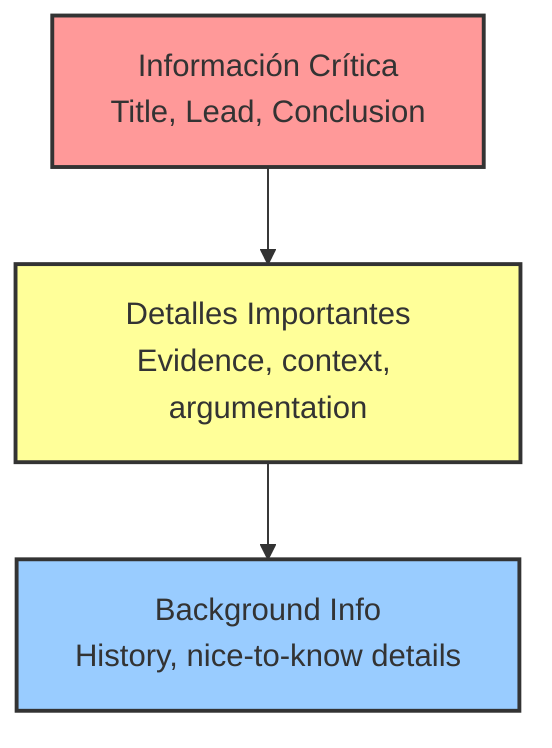

# TEMA 1.1.2: ESTRUCTURA DE PIRÁMIDE INVERTIDA

**Tiempo estimado**: 15 minutos
**Nivel**: Principiante
**Prerrequisitos**: Tema 1.1.1 (Voz Pasiva)

## ¿Por qué importa este concepto?

En la escuela nos enseñaron a escribir ensayos: Introducción -> Desarrollo -> Clímax -> Conclusión.
Esto funciona para novelas de misterio.
Para documentación técnica, **es un desastre**.

Un ingeniero que busca un error a las 3 AM no quiere misterio. Quiere la solución **YA**.
Si escondes la respuesta al final del párrafo, estás quemando su tiempo.

## Conexión con conocimientos previos

* **Tema 1.1.1**: Usar voz activa hace que las oraciones sean directas. La Pirámide Invertida hace que el *párrafo* sea directo.
* **TL;DR** (Too Long; Didn't Read): Es la aplicación más pura de este concepto.

---

## Comprensión intuitiva

Imagina que eres un periodista de 1920 enviando una noticia por telégrafo durante la guerra.
La línea puede cortarse en cualquier momento.
Tienes que decir lo más importante **primero**.

1. "El Titanic se hundió". (Lead)
2. "Murieron 1500 personas". (Detalles clave)
3. "La orquesta tocó hasta el final". (Color/Contexto)

Si se corta la línea después de la frase 1, la noticia principal llegó.

---

## Definición formal

La **Pirámide Invertida** ordenan la información por orden de importancia decreciente, no cronológico.

### Estructura

1. **El Lead (La Cima de la Pirámide)**: ¿Qué pasó? ¿Cuál es el resultado? ¿Qué debo hacer?
2. **El Cuerpo (El Medio)**: Evidencia, argumentos, pasos detallados.
3. **El Contexto (La Punta)**: Antecedentes, enlaces relacionados, "nice to know".

---

## Implementación práctica

### Ejemplo: Reporte de Estatus

**Mal (Cronológico)**:
> "Ayer revisamos los logs y vimos errores. Luego reiniciamos el servidor. Pareció funcionar, pero luego falló de nuevo. Investigamos la DB y vimos bloqueos. Al final, liberamos los bloqueos y el sistema subió."

**Bien (Pirámide Invertida)**:
> **El sistema está estable ahora.**
> Causa raíz: Bloqueos en la base de datos que liberamos manualmente.
> *Cronología*: Detectamos errores ayer, reiniciamos (fallido), encontramos bloqueos y resolvimos.

### Ejemplo: Documentación de Función

**Mal**:
> "Esta función primero inicializa un buffer, luego itera sobre el array, verifica nulos... y finalmente retorna el promedio."

**Bien**:
> **Retorna el promedio de un array de números.** (Ignora nulos automáticamente).
> *Detalles de implementación*: Usa un buffer interno para...

---

## Errores frecuentes

### Error 1: "Enterrar el Lead" (Burying the Lead)

Empezar con "Debido a los recientes cambios en la arquitectura de microservicios..." en lugar de "El endpoint /users está deprecado".

### Error 2: Asumir que el lector leerá todo

Los usuarios **escanean** (patrón de lectura en F). Solo leen las primeras palabras de cada párrafo.
Si la información importante está en la línea 5, es invisible.

---

## Resumen del concepto

**En una frase**: Dile al lector qué pasó antes de explicarle cómo pasó.

**Regla de Oro**: Si el usuario deja de leer después de la primera frase, ¿se llevó la información vital? Si es sí, usaste bien la pirámide.

**Siguiente paso**: Ejercicios para reescribir textos cronológicos.
