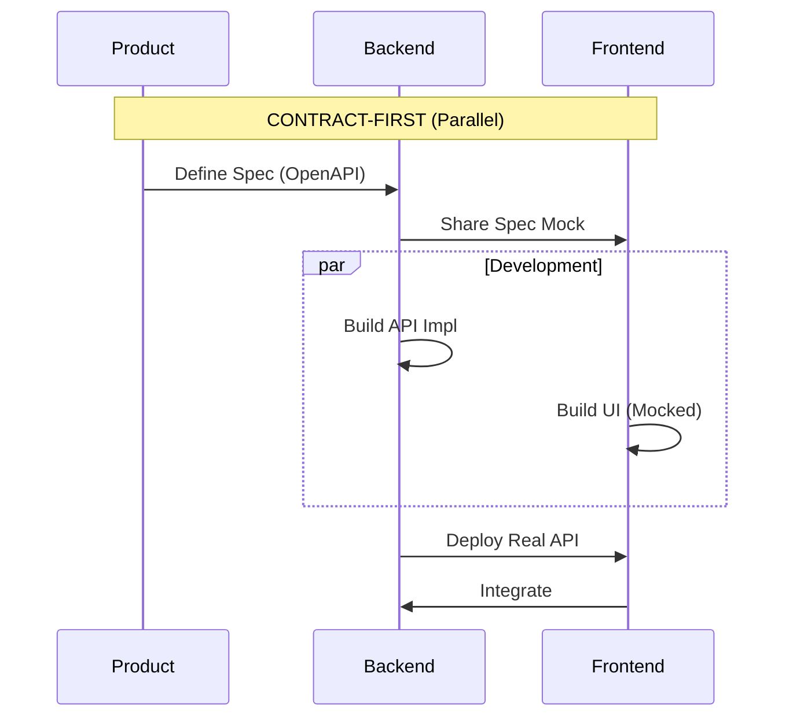

# TEMA 3.1.1. OPENAPI/SWAGGER (CONTRACT-FIRST)

**Tiempo estimado**: 35 minutos
**Nivel**: Intermedio
**Prerrequisitos**: Módulo 2 (Documentación en Código)

## ¿Por qué importa este concepto?

Imagina construir un puente empezando desde los dos extremos sin planos, esperando encontrarse en el medio.
Eso es desarrollar APIs **Code-First** (primero el código, luego la doc).
Resultado: El Frontend espera un array y el Backend manda un objeto. El puente se cae.

**Contract-First** significa dibujar el plano (OpenAPI Spec) antes de poner un solo ladrillo (código).

## Conexión con conocimientos previos

* **Tema 2.2.1 (README)**: Un README explica *cómo instalar*. Una Spec de OpenAPI explica *cómo interactuar*.
* **Tema 1.2.1 (Audiencia)**: La audiencia de tu API es una máquina (que necesita precisión estricta) y un humano (que necesita ejemplos claros).

---

## Comprensión intuitiva

OpenAPI es el **Contrato de Alquiler** entre el Backend y el Frontend.
Firmas el contrato *antes* de mudarte.
Si el contrato dice "El alquiler son 500 euros", el casero no puede pedirte 600 después.
Si la API Spec dice "devuelvo un string", el Backend no puede devolver un null.

---

## Definición formal

**OpenAPI (antes Swagger)** es un estándar para describir APIs REST en formato YAML o JSON.
Es agnóstico del lenguaje (funciona para Node, Python, Java, etc.).

### Flujo de Trabajo



1. **Diseño**: Escribes el archivo `openapi.yaml`. Nadie programa todavía.
2. **Acuerdo**: Frontend y Backend revisan el YAML. ¿Falta un campo? Se arregla en el texto.
3. **Mocking**: Herramientas automáticas generan un servidor falso basado en el YAML.
4. **Desarrollo Paralelo**: Frontend programa contra el Mock. Backend programa la implementación real.

---

## Implementación práctica

### Estructura básica de un archivo OpenAPI (YAML)

```yaml
openapi: 3.0.0
info:
  title: Meteor Weather API
  version: 1.0.0
paths:
  /weather:
    get:
      summary: Obtiene el clima actual
      parameters:
        - name: city
          in: query
          required: true
          schema:
            type: string
      responses:
        '200':
          description: Éxito
          content:
            application/json:
              schema:
                type: object
                properties:
                  temp:
                    type: integer
                    example: 24
```

### Herramientas

* **Swagger Editor**: Para escribir y previsualizar.
* **Stoplight**: Interfaz visual para no lidiar con YAML puro.
* **Postman**: Puede importar OpenAPI para generar tests.

---

## Errores frecuentes

### Error 1. Generar la documentación desde el código (Code-First)

Usar anotaciones en Java/Python para generar el Swagger al final.
*Problema*: La documentación siempre llega tarde y refleja "lo que el código hace" (bugs incluidos), no "lo que debería hacer".

### Error 2: "Enums" no documentados

Un campo `status` que devuelve `1`, `2` o `3`.
Sin documentación, el consumidor tiene que adivinar qué significa cada número mágicos.

---

## Resumen del concepto

**En una frase**: Escribe la documentación *antes* de escribir el código. Ahorrarás semanas de refactorización.

**Regla de Oro**: Si cambias la API, actualizas el contrato (Spec) primero, y el código después.

**Siguiente paso**: Ejercicios para leer y escribir YAML de OpenAPI.
