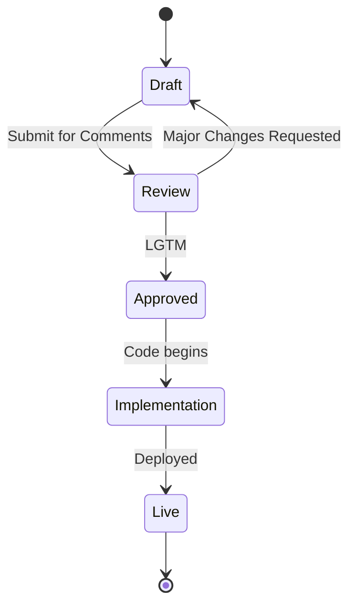

# TEMA 4.1.1. ANATOMÍA DE UN DESIGN DOC

**Tiempo estimado**: 30 minutos
**Nivel**: Avanzado
**Prerrequisitos**: Módulo 3 (APIs)

## ¿Por qué importa este concepto?

Escribir código es caro. Reescribir código es 10 veces más caro.
Un **Design Doc** (Documento de Diseño) es la herramienta más barata para detectar errores arquitectónicos *antes* de escribir una sola línea de código.
Es "pensar en papel".

## Conexión con conocimientos previos

* **Tema 1.1.2 (Pirámide Invertida)**: Un Design Doc debe tener un Resumen Ejecutivo al principio.
* **Tema 3.1.1 (Contract-First)**: El Design Doc es el contrato, pero de la arquitectura interna, no solo de la API pública.

---

## Comprensión intuitiva

Imagina que vas a construir un rascacielos.
¿Empiezas a poner ladrillos el día 1? No.
Haces un plano (Blueprint).
Se lo enseñas a los ingenieros estructurales, a los bomberos, a los electricistas.
Ellos te dicen: *"Oye, pusiste los baños lejos de las tuberías de agua"*.
Corriges el plano con un borrador. Costo: 0 euros.
Si hubieras construido la pared, el costo sería millonario.

---

## Definición formal

Un **Design Doc** (o RFC - Request for Comments) es un documento técnico que describe la solución propuesta a un problema complejo.

### Ciclo de vida

### Secciones Clave (Plantilla Estándar)

1. **Contexto y Alcance**: ¿Qué problema resolvemos? ¿Qué NO vamos a resolver?
2. **Alternativas Consideradas**: *"Pensamos en usar MongoDB, pero lo descartamos porque..."*. (Esta es la sección más valiosa).
3. **Diseño Propuesto**: Diagramas de arquitectura, modelos de datos, endpoints.
4. **Riesgos y Migración**: ¿Cómo pasamos del sistema viejo al nuevo sin apagar todo?

---

## La regla del 10%

Si tardas 10 días en programar una feature, deberías haber pasado 1 día escribiendo el Design Doc.
Ese día te ahorrará 3 días de bugs y refactorización futura.

---

## Errores frecuentes

### Error 1. Escribirlo después de programar

Eso no es un Design Doc, es documentación arqueológica. No sirve para prevenir errores.

### Error 2: Diseño detallado innecesario

No documentes nombres de variables o clases privadas. El código cambia. Documenta flujos de datos y responsabilidades de componentes.

### Error 3: Ocultar los riesgos

Un buen ingeniero dice: *"Esta solución es rápida, pero no escala a 1 millón de usuarios"*.
Un mal ingeniero dice: *"Es perfecta"*.

---

## Resumen del concepto

**En una frase**: El código gana argumentos; los Design Docs evitan que los argumentos ocurran.

**Regla de Oro**: Busca el feedback negativo. Si todos dicen "LGTM" (Looks Good To Me) sin leer, tu Design Doc falló. Quieres que alguien encuentre el agujero de seguridad ahora, no los hackers después.

**Siguiente paso**: Ejercicios para analizar alternativas y trade-offs.
